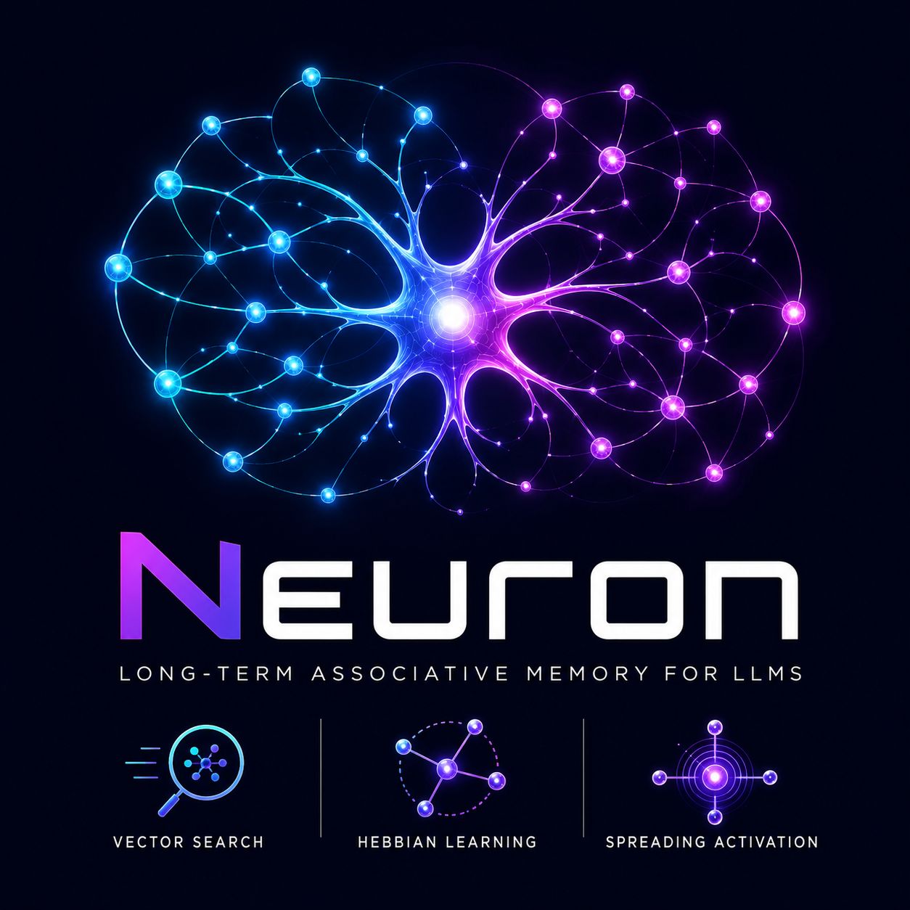

<!-- ════════════════════════════════════════════════════════════════════ -->
<!--                            NEURON · README                            -->
<!-- ════════════════════════════════════════════════════════════════════ -->

<div align="center">



<h1>🧠 Neuron</h1>

<h3>Persistent semantic memory for AI — an MCP server that lets any LLM <em>remember</em>.</h3>

<p>
Neuron gives your AI a brain that lasts beyond a single chat. Every exchange becomes
concepts, links and vector embeddings in a living graph — so the model recalls what
you discussed yesterday, connects ideas across topics, and gets smarter the more you use it.
</p>

<br>

<!-- ── identity badges ─────────────────────────────────────────────── -->


<br><br>

<!-- ── nav buttons ─────────────────────────────────────────────────── -->
<a href="#-quickstart"></a>
<a href="#-how-it-works"></a>
<a href="INSTALL.md"></a>
<a href="docs/DEVELOPER.md"></a>
<a href="CHANGELOG.md"></a>

</div>

---

## ✨ What is Neuron?

Neuron is a **local-first [MCP](https://modelcontextprotocol.io) server** that gives large
language models **long-term, associative memory**. Point any MCP client at it (Claude,
Cursor, OpenCode, VS Code, ChatGPT via a bridge, and more) and across every conversation
Neuron builds a **concept graph**:

- every meaningful turn stores **keywords** with **384-dim vector embeddings** and typed
  **semantic links**, organized into topic **contexts** with inheritance from parents;
- retrieval is **associative**, not just keyword matching — spreading activation, salience &
  recency ranking, and cross-context "drift" surface the *right* memory even without an exact hit;
- it runs **local-first** (one `.db` file, no daemon, no network) and can optionally back a
  **shared team memory** on Turso Cloud where several people write into the same brain at once.

> **In one line:** stop re-explaining context to your AI every session. Neuron remembers.

---

## 🌟 Highlights

|  | Feature | What it means for you |
|---|---|---|
| 🧩 | **Associative memory** | Hebbian link reinforcement, spreading activation, salience/recency ranking — memories that fire together wire together. |
| 🌐 | **Any MCP client** | Claude Desktop/Code, Cursor, OpenCode, VS Code, Windsurf, Zed, Cline/Roocode, Continue, Cody, Amazon Q — plus ChatGPT via an HTTP bridge. |
| 💾 | **Local-first, zero setup** | Embedded libSQL with native `vector_distance_cos()`. One file. No server, no port, no cloud required. |
| 👥 | **Shared team brain (optional)** | Flip on Turso Cloud and everyone writes into one graph — atomic, concurrent, no one's save clobbers another's. |
| 🎯 | **Quality at the door** | A curation gate drops filler, folds duplicates and canonicalizes links, so the graph stays clean instead of bloating. |
| 📖 | **Episodic facts** | Nodes carry short "what actually happened" facts, surfaced back into context on the next turn. |
| 🕰️ | **Time-travel visualizer** | A self-contained interactive HTML graph — replay your memory growing turn by turn, filter by domain, inspect every node & link. |
| 🩺 | **Batteries-included tooling** | Cross-platform CLI (`neuron register` / `doctor`), a Tkinter visual hub (`neuron gui`), and a full test suite. |

---

## 🧠 How it works

Neuron runs a simple **two-step loop** around every substantial turn:

```
        ┌─────────────────────────────────────────────────────────┐
        │  1. pre_turn(topic, keywords)                           │
        │     → loads the relevant slice of memory BEFORE you reply │
        └─────────────────────────────────────────────────────────┘
                              │  the model answers, now informed
                              ▼
        ┌─────────────────────────────────────────────────────────┐
        │  2. store_turn(keywords, links, facts…)                 │
        │     → saves what's NEW as concepts + typed links         │
        └─────────────────────────────────────────────────────────┘
```

Under the hood each concept is a **node** (keyword + embedding + salience + domain), each
relationship a **typed link** (`cause-effect`, `analogy`, `evolution`, `contrast`,
`deepening`, `instance-of`). Links that keep co-activating get **reinforced**; idle tangential
ones get **pruned**; concepts you stop touching fade to **dormant**. Retrieval blends vector
similarity, graph traversal and salience — so the model recalls what *matters*, not only what
literally matches.

---

## ⚡ Quickstart

### 🪟 Windows

Double-click **`install.cmd`** (or run `.\install.ps1` from a terminal).
No Python? The installer bootstraps it via winget (official python.org build).

A thin launcher for the **unified Gray Matter installer**: installs GM + Neuron
into one venv (pre-built `pyturso` wheel from `vendor/`, no C/Rust compiler),
registers the gateway in your MCP clients, deploys session hooks and creates the
**Gray Matter GUI** shortcut on the Desktop — the single front door for setup,
registration, maintenance and logs. No terminal needed for normal use.

### 🍎 macOS / 🐧 Linux

Double-click **`install.command`** (or `sh install.sh` from a terminal).
No Python? The installer offers brew/apt/dnf.

Same unified installer as Windows (thin launcher → `gray_matter/install.sh`):
one venv, gateway registered, hooks deployed, **Gray Matter GUI** shortcut on
the Desktop. `pyturso` ships prebuilt wheels on PyPI for macOS/Linux.

From a source checkout: `pip install ".[dev]"`.

📖 Full instructions, the manual path and troubleshooting live in **[INSTALL.md](INSTALL.md)**.

---

## 🔌 Mounting in an MCP client

> **🧠 Recommended: the Gray Matter gateway.** Neuron ships alongside
> [Gray Matter](../gray_matter/), an orchestrator that registers **one** server
> in your clients and runs Neuron (and NeuRAG) as warm managed workers — plus a
> combined `gray_matter_pulse`, context cache and cross-store bridges.
> One command does everything (register, hooks, plugins, manifest):
> `gray-matter install`. AI agents: follow [`INSTALL-AI.md`](INSTALL-AI.md).
> The table below is the **standalone** path.

Neuron is a **local stdio MCP server** — your client launches it as a subprocess. "Mounting"
just means registering that launch command; on Windows the installer can do it for you.

| Client | How to mount | Notes |
|---|---|---|
| **Claude Desktop, Cursor, OpenCode** | auto-registered by `install.ps1` (or `neuron register`) | restart the client |
| **Claude Code, VS Code, Zed, Windsurf, Cline/Roocode, Continue, Cody, Amazon Q** | add the launch command (`python -m neuron`) | local stdio |
| **ChatGPT / OpenAI** | via an HTTP bridge — see the **[Bridge guide](docs/BRIDGE.md)** | Developer Mode, paid plans |

Ready-made JSON snippets for every client live in [`clients/`](clients/). Example — OpenCode
(`~/.config/opencode/opencode.json`):

```json
{
  "mcp": {
    "neuron": { "command": ["python", "-m", "neuron"], "type": "local" }
  }
}
```

---

## 💾 Storage: local, or shared on Turso Cloud

Neuron resolves its storage tier automatically, in this order:

1. **Turso Cloud** — when `TURSO_DATABASE_URL` + `TURSO_AUTH_TOKEN` are set. Memory is shared
   across machines and people; `vector_distance_cos()` runs server-side.
2. **Local pyturso** — embedded libSQL, native vector search, one local file *(the default)*.
3. **stdlib sqlite3** — last-resort fallback, Python-side cosine similarity.

One connection layer serves all three, so working solo vs. as a team is **just a connection
string** — no code changes. Turn on the cloud in one step:

```bash
pip install "neuron[cloud]"
python scripts/connect_turso.py     # prompts, live-tests the connection, saves to .env
```

👥 Running a whole team on one brain? See the **[Team guide](docs/TEAM.md)**.

---

## 🕰️ Graph Visualizer

Neuron ships an interactive, **self-contained HTML visualizer** — launch it from
`neuron manage` (option 4, Graph visualizer) or `python scripts/generate_graph_html.py`. It reads through
Neuron's own engine (so it sees the cloud too) and gives you:

salience-sized, domain-colored nodes · Hebbian-thickened edges · drift-link styling ·
dormant fading · neighborhood highlight · search · domain/type filters · an **insights panel**
(hubs, most-salient, dormant, strongest synapses, cross-context bridges) · a **Replay slider**
that animates your memory growing turn by turn · and an Obsidian-style 🎨 appearance editor.

---

## 🧰 MCP tools

<details>
<summary><strong>The core loop</strong></summary>

| Tool | Description |
|---|---|
| `neuron_pre_turn(topic, keywords)` | **PRE shortcut** — status + compact context in one call |
| `neuron_store_turn(...)` | Save a turn: keywords, links, entities, tags, an episodic fact |
| `neuron_confirm(keywords)` | Boost salience of nodes that influenced the response |
| `neuron_get_context(topic, ...)` | Related nodes/links; `format=compact` for injection; inherits from parents |

</details>

<details>
<summary><strong>Search, curation & contexts</strong></summary>

| Tool | Description |
|---|---|
| `neuron_status` / `neuron_summary` | Graph state · top nodes and recent links |
| `neuron_vector_search(keywords)` | Semantic vector search (no link traversal) |
| `neuron_find_candidates(keywords)` | Find similar existing keywords before storing (dedup) |
| `neuron_merge(canonical, aliases)` | Absorb duplicate nodes into one |
| `neuron_extract(text)` / `neuron_auto(text)` | Standalone extraction · extract-and-save in one call |
| `neuron_switch_context` / `neuron_list_contexts` | Switch / list domain contexts (e.g. `java/spring`) |
| `neuron_forgotten` / `neuron_prune` | Concepts idle for N turns · force-prune expired links |
| `neuron_export` / `neuron_reset` | Export the graph as JSON · clear it |

</details>

---

## 🛠️ Development

```bash
pip install -e ".[dev]"
python -m pytest tests/ -v        # unit tests (fastembed/mcp/turso mocked — no network)
python -m build                   # wheel + sdist (CI verifies this on every push)
```

Architecture, the DB layer, per-client config and cloud/bridge internals are documented in
**[docs/DEVELOPER.md](docs/DEVELOPER.md)**; release & CI mechanics in
[docs/RELEASE_PLAN.md](docs/RELEASE_PLAN.md). Requires **Python 3.10–3.14**.

---

## 🗺️ Documentation map

| Doc | What's in it |
|---|---|
| **[INSTALL.md](INSTALL.md)** | Every install path (Windows one-click → manual → source) + troubleshooting |
| **[INSTALL-AI.md](INSTALL-AI.md)** | Automated install+register instructions for AI agents (EN · [IT](INSTALL-AI.it.md)) |
| **[docs/DEVELOPER.md](docs/DEVELOPER.md)** | Architecture, memory dynamics, DB layer, per-client config |
| **[docs/TEAM.md](docs/TEAM.md)** | Running a shared team brain on Turso Cloud |
| **[docs/BRIDGE.md](docs/BRIDGE.md)** | Exposing Neuron over HTTP for ChatGPT / remote connectors |
| **[CHANGELOG.md](CHANGELOG.md)** | The full v5 "Synapse" story, release by release |

---

## 👤 Author

<div align="center">

**Neuron** is designed and built by **Claudio Costantino**.

<a href="https://www.linkedin.com/in/clacosta1999/"></a>
<a href="https://github.com/recla93/Neuron"></a>

<sub>Found Neuron useful? A ⭐ on the repo genuinely helps.</sub>

</div>

---

## 📜 License

**PolyForm Noncommercial License 1.0.0** — free for noncommercial use. See [LICENSE](LICENSE).

<div align="center"><sub>Built with 🧠 — because your AI shouldn't forget everything the moment you close the tab.</sub></div>
